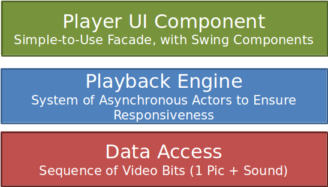

# Exmoplay

Exmoplay is a movie player implemented in Java based on [Xuggler](http://www.xuggle.com/xuggler). The goal was to create a movie player which always stays responsive (never blocks) and keeps following the user's intent as closely as possible. It allows to explore a video basically frame by frame. Different playback speeds are supported, even backwards playing of a movie (including sound backwards), which is quite a unique feature among movie players.

## Architecture & Design

Exmoplay consists of three layers, where each of the lower layers is independent of the ones above and could potentially be reused in other contexts.

### Data Access Layer

This layer abstracts over the video access library (Xuggler). It segments the video into logical "frames" that are decompressed and contain one picture and the sound data for the duration of the picture.

This abstraction enables the playback engine to load, cache and deliver the frames in a simplified way.

### Playback Engine

This layer contains a system of actors (based on my own micro library), that can work in parallel to allow a continous non-blocking streaming of frames.

### Player UI Component

This layer contains Swing UI components for the playback engine, which provide the interface between the user and the engine. The engine can also be controlled programmatically without this layer.

## The Design of the Engine

Each of the actors in the Playback Engine layer runs on its own thread.

FrameFetcher listens for requests for loading a certain range of frames and simply calls its MediaInputStream to load these.

The FrameCache always stores a fixed number of frame segments based on a least recently used (LRU) principle. The Controller only talks to the FrameCache when requesting frames and the FrameCache in turn asks the FrameFetcher if it cannot respond to a request of the Controller immediately. While those frames are being loaded the Controller can already ask for further frames and if those are cached, they might be delivered before those of the first request.

The Controller takes care of the current movie position and orchestrates all the other actors around it. It asks the FrameCache for segments of frames and then sends the individual frames to the VideoRenderer and the AudioRenderer. For the AudioRenderer it has to send them in advance, while for the VideoRenderer it will send them on time (when the frame is to be displayed).

## Slides

Here are some slides of an internal Tech Talk presentation that I did about exmoplay:

Slides [pptx](readme-images/videott.pptx) [pdf](readme-images/videott.pdf)

## Notes

If you are looking for a Java library to access video files, maybe now Xuggler might no longer be the best choice.

These could be potential alternatives:

- [JCodec](http://www.jcodec.org/) Open source pure Java implementation (also usable for Android)
- [Humble Video](https://github.com/artclarke/humble-video) The successor of Xuggler, based on native FFMPEG

